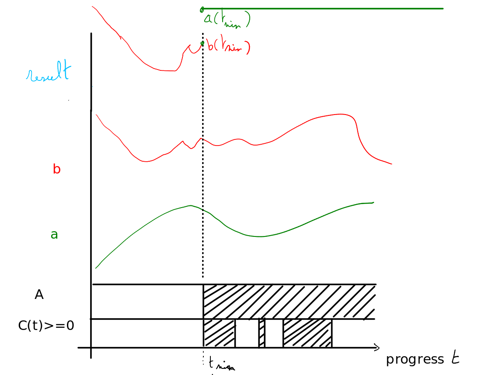

The earliest-value expressiongraph node
----------------------------------------

Implements an expressiongraph node that can be used for various problems such as:
 - having a specific value after a condition occurred.
 - having a monitor that is triggered a given time after a condition occurred
 - etc..

This node gives a Value at the earliest time that a condition holds.
With progress t and condition C, it has the result of  
earliest(t,C,a,b) has the following semantics:

A = { t in T |  there exists t1 t in T for which C(t1,...) >= 0 & t >= t1}

tmin = min A

r = a(tmin) if t in A
  = b(t)    if t not in A

(where t,C,a,b are all expressions)

