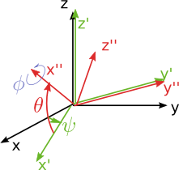

getRPY
------

Function and expressiongraph node to get the roll, pitch, yaw angles and their derivatives.

In eTaSL, the expression is constructed as:

.. code-block:: lua

    roll,pitch, yaw = getRPY( R)

where R is an expression for a rotation matrix and roll, pitch and yaw are scalar expressions.

In the C++ API, you have:

.. code-block:: c++
    
    Expression<Vector>::Ptr getRPY( Expression<Rotation>::Ptr R )

The roll pitch yaw convention of a rigid boy is defined as follows:  you first rotate the rigid body 
around the x-axis using the roll angle phi, then around
the y-axis using the pitch angle and then around 
the z-axis using the yaw angle:

.. code-block:: lua
    RPY(phi,theta,psi) = Rot(Z,psi) * Rot(Y, theta) * Rot(X, phi)

